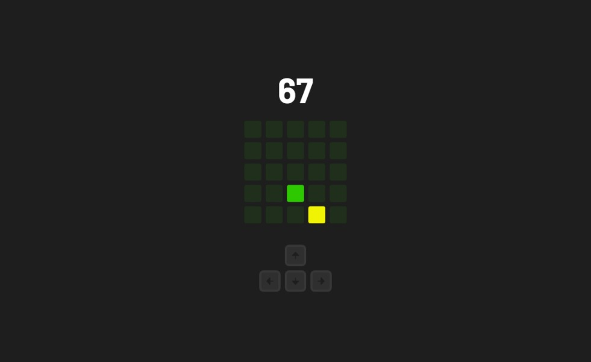

# PointGame

Simples jogo de acumulação de pontos para ser jogado no teclado.



### Future Features

-  [ ] Adicionar um botão de reset/pause
-  [ ] Modo de jogo com tempo
-  [ ] Modo de jogo com limite de movimentos

## How to install

```bash
# Clone o repositório
$ git clone

# Entre no diretório
$ cd PointGame

# Instale as dependências
$ npm install or yarn install

# Rode o projeto
$ npm run dev or yarn dev
```

## Contributing

Sinta-se a vontade para contribuir com o novas ideias de features ou implementações de features.
